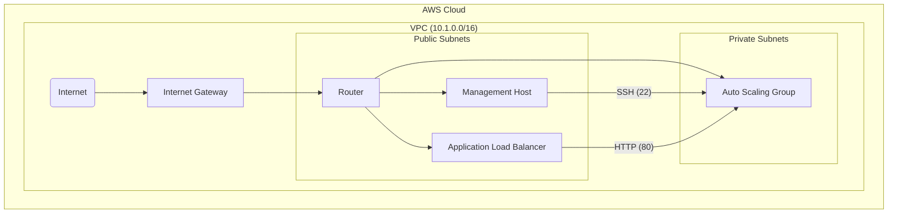

Caveats:
* The install_apache.sh script is running on the instances, but it never completes, so Apache never starts. Further troubleshooting would be needed.
* I used t3.micro instances in my setup. I'm using a free tier AWS account and I got an error saying t2.micro wasn't available. I left the instances as t3s in the Terraform code to reflect this.

### Analysis

#### Security Gaps

The management EC2 instance is directly accessible from the internet from a specific IP. It would be better to use session manager.

Apache is only running on port 80. It would need to be switched to 443 with an SSL cert.

#### Availability Issues

There's a single management instance, creating a single point of failure. The ALB could be set to be multiregion for added availability.

#### Cost Optimization Opportunities

Instances could be reserved if this were to be a long term project with a predictable workload. Or the instances could be shut down at night (if this is a dev env and nobody needs it available at night, for instance), or the scaling policy could be reduced even more (to one instance) if needed.

#### Operational Shortcomings

No observability: no metrics, no tracing, no logs, no dashboards, no alerting. No backups. No DR setup. No BCP analysis. This is a very fragile setup and I wouldn't want to support this!

-----

### Improvement Plan

#### Prioritized Changes

I had issues with the management instance ec2_key_pair using the CF TF module (I left that in main.tf but commented it out). I got it working, but I'd set up session manager as my first priority, since it's pretty low hanging fruit and an improvement to this setup.

Observability is missing completely. The people supporting this setup would be flying completely blind if they had to troubleshoot issues. I'd set up alarms for the ASG and the ALB as a first measure. There also should be centralized logging (for the Apache logs of all the instances).

#### Implemented Improvements (Code Examples)

I'd use this repo to set up session manager: https://github.com/aws-samples/enable-session-manager-terraform

```hcl
resource "aws_iam_role" "ssm_role" {
  name = "MySSMInstanceRole"

  assume_role_policy = jsonencode({
    Version = "2012-10-17"
    Statement = [
      {
        Action = "sts:AssumeRole"
        Effect = "Allow"
        Principal = {
          Service = "ec2.amazonaws.com"
        }
      },
    ]
  })
}

resource "aws_iam_role_policy_attachment" "ssm_policy" {
  role       = aws_iam_role.ssm_role.name
  policy_arn = "arn:aws:iam::aws:policy/AmazonSSMManagedInstanceCore"
}

resource "aws_iam_instance_profile" "ssm_profile" {
  name = "MySSMInstanceProfile"
  role = aws_iam_role.ssm_role.name
}

resource "aws_instance" "my_ssm_instance" {
  ami           = "ami-0c55b159cbfafe1f0" # Example AMI, choose one with the SSM agent pre-installed
  instance_type = "t3.micro"
  subnet_id     = "subnet-xxxxxxxx"
  vpc_security_group_ids = ["sg-xxxxxxxx"]

  iam_instance_profile = aws_iam_instance_profile.ssm_profile.name

  tags = {
    Name = "My-SSM-Instance"
  }
}
```

Here is a code example for adding cloudwath alerting:

```hcl
resource "aws_sns_topic" "alarm_topic" {
  name = "asg-alarms"
}

resource "aws_cloudwatch_metric_alarm" "high_cpu_utilization" {
  alarm_name          = "high-cpu-utilization"
  comparison_operator = "GreaterThanThreshold"
  evaluation_periods  = 2
  metric_name         = "CPUUtilization"
  namespace           = "AWS/EC2"
  period              = 300
  statistic           = "Average"
  threshold           = 75
  alarm_actions       = [aws_sns_topic.alarm_topic.arn]
  dimensions = {
    AutoScalingGroupName = aws_autoscaling_group.asg.name
  }
}
```

-----

### Runbook

#### How to Deploy and Operate

1.  **Install Prerequisites:** You'll need Terraform and Git installed.
2.  **Configure AWS Credentials:** Set up your AWS credentials either through env variables or in `~/.aws/credentials`. In AWS, set up an ssh key that will be used to log into the management instance.
3.  **Clone this repo:** Using git, you'll need to clone this repository.
3.  **Initialize Terraform:** In the directory with the Terraform files, run `terraform init`. This will download the necessary provider plugins.
4.  **Review the Plan:** Run `terraform plan` to see a detailed list of all the resources that will be created, modified, or destroyed (if this is the first time running this, there will only be new stuff created, not modified or destroyed). Review this plan carefully to ensure it matches expectations.
5.  **Apply the Configuration:** If the plan looks correct and shows no erros, run `terraform apply`. You will be prompted to confirm the actions. Type `yes` to proceed.
6.  **Access the Application:** Once `terraform apply` is complete, the output will provide the DNS name for the Application Load Balancer. You can access the website through this URL.
7.  **Operate:** You can ssh to the management ec2 instance using the key you set up in step 2.

#### How to Respond to an Outage for the EC2 Instance

  * **Application Servers:** The application instances are part of an Auto Scaling Group (ASG). If an instance becomes unhealthy (e.g., it fails a health check), the ASG will automatically terminate it and launch a new one. Once the CloudWatch alarm is implemented there could be alerting in place, then you could investigate the root cause of the failure from the instance logs.
  * **Management Instance:** The management instance is a single, standalone EC2 instance. If it fails, a new EC2 instance would need to be created and configured to allow SSH from a designated IP. Terraform can be used for that.

#### How to Restore Data if the S3 Bucket were Deleted

There's no s3 in this setup. However, if one were part of the infrastructure (for instance, to host static files for Apache to serve), the restoration process would depend on the bucket's configuration.

1.  **Check for Versioning:** The first step would be to check if **S3 Versioning** was enabled on the bucket (that would be ideal!). If it was, you can restore a previous version of the deleted objects.
2.  **Check for Cross-Region Replication:** If the bucket was configured for **Cross-Region Replication**, a copy of the data would exist in another AWS region. You could then restore the data from the replicated bucket.
3.  **Restore from Backups:** If neither of the above was configured, you would need to restore the data from a last-known-good backup, assuming a backup process was in place.



